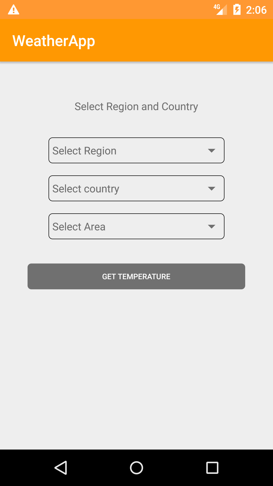
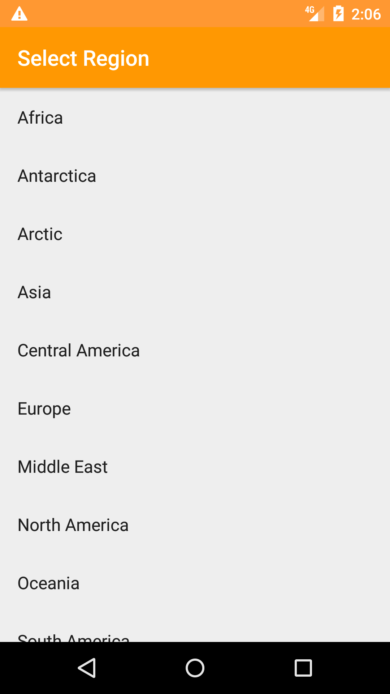
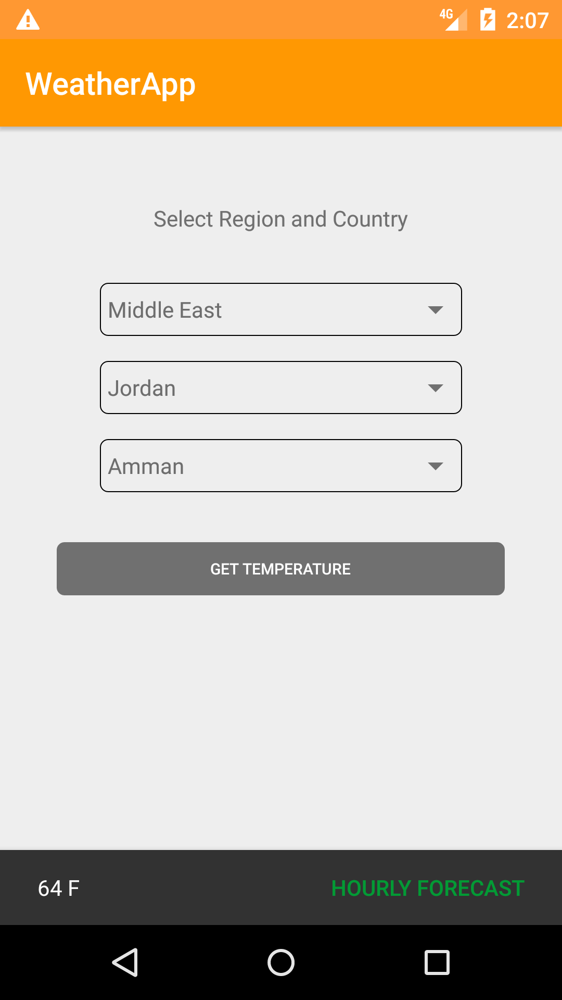

# WeatherApp
WeatherApp is an Android application that helps you to get the forecast and temperature for specific locations , This app is based on the AccuWeatherAPIs Forecast.


 
# Basic Usage
For examples of usage, run the demo app from project files using command line :
```ADB
adb install weather_app.apk
```
# Pre-requisites 
- Android Studio 3.2
- Gradle Version 3.2.0-alpha16
- Get ApiKey from AccuWearherAPIs by creating new application and generate the apiKey

# Build and install
Import Project into Andorid Studio.

In Android Studio, click on the "Run" button.

If you have everything set up correctly:
- The screen will show 3 pickers to select (Region , Country , Area) and Button to get temperature.
- If the button is pressed , the snackbar will be shown with a temperature of location selected.
- The snackbar has an action button if pressed will show hourly forecast.

The Forecast service has allowed app to call service 50/day , so if you have any problem , please add your own key by adding it in the build file system 
